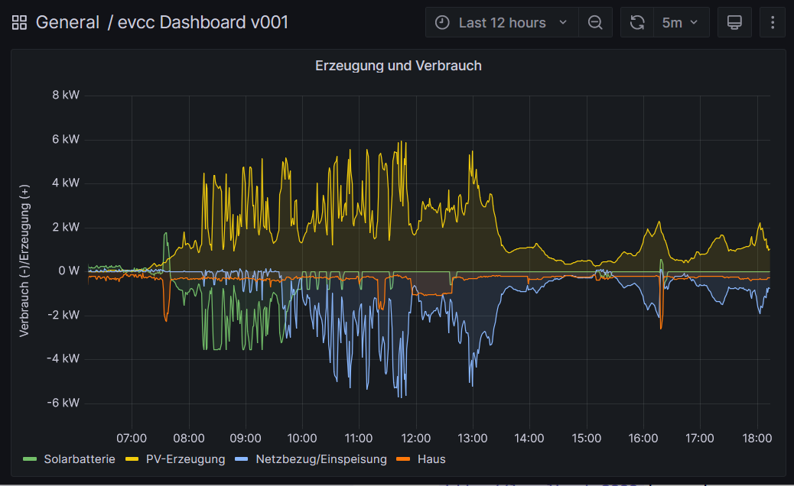
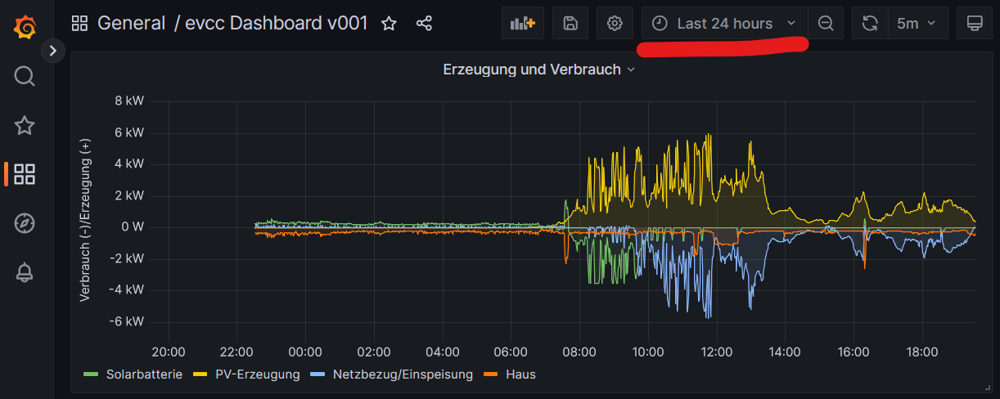

import Tabs from "@theme/Tabs";
import TabItem from "@theme/TabItem";

# Grafana Dashboard



## Dashboard - Wozu?

Ein Dashboard visualisiert ausgewählte Daten. Bei evcc sind dies vor allem die Zählerdaten (Strombezug, Erzeugung, Einspeisung und Ladung) im Zeitverlauf. Es können aber auch weitere Daten, wie der Sonnenstand oder Börsenstrompreise, eingebunden werden.
Dazu müssen die aktuellen Daten ständig in eine Datenbank geschrieben werden. Aus dieser werden sie dann später zur Visualisierung wieder ausgelesen. Als Datenbank findet InfluxDB Verwendung. Diese Datenbanksoftware ist auf die Verarbeitung von Zeitreihen mit Key/Value Paaren spezialisiert. Die Visualisierung der Daten erfolgt anschließend mit Grafana.

## Installation InfluxDB Version 1.8.x
:::note
Voraussetzung für die Installation sind grundlegende Kenntnisse im Umgang mit der Kommandozeile und einem Editor wie nano oder vi!
:::

- Ausgangspunkt für die Installation ist ein aktuelles Debian/Ubuntu/Raspberry-Linux mit installierten evcc. Ältere Versionen (Ubuntu 18.04 LTS, Debian 10 Buster) benötigen ggf. Anpassungen bei der Installation. 

- Öffne ein Terminal/Eingabeaufforderung

- Version prüfen. Im April 2023 ist bei Debian die Version 11 (bullseye) und bei Ubuntu die Version 22 (die auf Debian 11 basiert) aktuell. Für diese Version ist die Anleitung geschrieben. 

  ```sh
  cat /etc/os-release
  ```

- evcc Dienst stoppen und System inklusive evcc aktualisieren:

  ```sh
  sudo systemctl stop evcc
  sudo apt update
  sudo apt upgrade -y
  ```

- Download und Import von InfluxData’s Public Key. Für ältere Linuxversionen muss im Folgenden `influxdata-archive.key` durch `influxdata-archive_compat.key` ersetzt werden.
  ```sh
  curl -sL https://repos.influxdata.com/influxdata-archive.key | gpg --dearmor | sudo tee /etc/apt/trusted.gpg.d/influxdata-archive.gpg > /dev/null
  ```

- Repository von InfluxDB einbinden:
  ```sh
  echo 'deb https://repos.influxdata.com/debian stable main' | sudo tee /etc/apt/sources.list.d/influxdata.list
  ```

- InfluxDB in der aktuellen Version 1.x installieren. Eine Übersicht über die Releases gibt https://github.com/influxdata/influxdb/releases. 

  :::note
  Die InfluxDB in der Version 2.x kann grundsätzlich auch verwendet werden, benötigt aber deutliche Anpassungen der Konfiguration. So wird statt Usern mit Token und statt Datenbase mit Bucket gearbeitet. Die Version 2.x ist nur noch 64-bittig verfügbar und scheidet damit für ältere RaspberryPis aus.
  :::

  ```sh
  sudo apt update
  sudo apt install -y influxdb
  ```
- InfluxDB starten sowie als Dienst einrichten, so dass es nach dem Booten automatisch startet.
  ```sh
  sudo systemctl unmask influxdb
  sudo systemctl enable influxdb
  sudo systemctl start influxdb
  ```

- Der Status von InfluxDB kann wie folgt überwacht werden:
  ```sh
  sudo systemctl status influxdb
  ```
- In den nächsten Schritten wird die Datenbank erzeugt, in die später evcc alle Daten periodisch ablegt. Des Weiteren wird der User mit Password angelegt sowie die Berechtigungen gesetzt. Dazu müssen wir uns in InfluxDB an der Shell anmelden:
  ```sh
  influx
  ```
  Eine erfolgreiche Anmeldung sollte mit `Connected to http://localhost:8086 version 1.8.10` und `InfluxDB shell version: 1.8.10` quitiert werden. Die Version kann ggf. abweichen (1.8.10<=Version<2.0).
- Wir sind jetzt auf der Shell von InfluxDB und können nun die Datenbank anlegen:
  ```sh
  create database evcc;
  ```
- Wir öffnen die Datenbank evcc:
  ```sh
  use evcc;
  ```
- Nutzer grafana mit selbst gewähltem Passwort anlegen:
  ```sh
  create user grafana with password 'MeinPasswort';
  ``` 
- Nutzer grafana alle Rechte an Datenbank evcc zuweisen:
  ```sh
  grant all privileges on evcc to grafana;
  ``` 
- Damit sind wir auf der InfluxDB Shell fertig. Mit `quit` verlassen wir die Datenbank Shell. 

  Nachfolgend noch einige Befehle, mit denen der Erfolg kontrolliert oder Nutzer und Datenbank auch wieder gelöscht werden können. Achtung, beim Löschen der DB gehen alle eventuell bereit gesammelten Daten verloren.
  ```sh
  show databases;
  show users;
  show grants for grafana;
  set password for grafana='NeuesPasswort';
  drop user grafana;
  drop database evcc;
  ```
  
- Abschließend müssen wir evcc dazu bringen, die Daten in unsere Datenbank zu schreiben. Dazu muss die Konfigurationsdatei von evcc bearbeitet werden. Sicherheitshalber sichern wir zuerst das Original:
  ```sh
  cp /etc/evcc.yaml ./evcc.yaml.original
  ```
  Kontrolliere, dass die Kopie erstellt wurde, damit bei Problemen die vorherige Konfiguration wieder hergestellt werden kann.

- Nun bearbeiten wir die Konfiguration mit einem Editor unserer Wahl (z.B. nano oder vi):
  ```sh
  sudo nano /etc/evcc.yaml 
  ```
  Am Ende der Datei ist folgendes anzufügen:
  ```sh
  influx:
    url: http://localhost:8086
    database: evcc
    user: grafana
    password: MeinPasswort
  ```
  Das Passwort ist ggf. anzupassen ;-)

- Teste, ob die Konfiguration funktioniert

  ```sh
  evcc -c /etc/evcc.yaml
  ```
  Wenn alles funktioniert, beende evcc durch drücken der Tastenkombination `CTRL-C`.

- Sollte etwas schief gegangen sein, können wir jederzeit unsere ursprüngliche evcc Konfiguration wieder zurück holen:
  ```sh
  sudo cp ./evcc.yaml.original /etc/evcc.yaml
  ```

- Wir können evcc bereits jetzt wieder starten. Es werden dann schon Daten in InfluxDB gesammelt, während wir mit der Installation von Grafana weitermachen.
  ```sh
  sudo systemctl start evcc
  ```

## Installation Grafana 

- Öffne ein Terminal/Eingabeaufforderung

- Download und Import von Grafana´s Public Key. 
  ```sh
  curl -sL https://packages.grafana.com/gpg.key | gpg --dearmor | sudo tee /etc/apt/trusted.gpg.d/grafana-archive.gpg > /dev/null
  ```

- Repository von Grafana einbinden:
  ```sh
  echo 'deb https://packages.grafana.com/oss/deb stable main' | sudo tee /etc/apt/sources.list.d/grafana.list
  ```

- Grafana in der aktuellen Version installieren. Eine Übersicht über die Releases gibt https://grafana.com/grafana/download. 
  ```sh
  sudo apt update
  sudo apt install -y grafana
  ```

- Grafana starten sowie als Dienst einrichten, so dass es nach dem Booten automatisch startet.
  ```sh
  sudo systemctl unmask grafana-server
  sudo systemctl enable grafana-server
  sudo systemctl start grafana-server
  ```

- Der Status von Grafana kann wie folgt überwacht werden:
  ```sh
  sudo systemctl status grafana-server
  ```

- Die Installation von Grafana ist damit abgeschlossen und die Konfiguration unserer Dashboards können beginnen. Grafana ist im Webbrowser unter `http://localhost:3000` erreichbar. Ersetze `localhost` durch die IP-Adresse (oder den Hostnamen), wenn der Browser auf einem anderen Rechner läuft. 

## Konfiguration der Grafana Dashboards

- Für die Neulinge unter uns ist das Tutorial "Data Source and Dashboards" https://grafana.com/tutorials/grafana-fundamentals/ vielleicht genau der richtige Einstieg in Grafana.

- Nach dem Tutorial nun die Praxis: Rufe Grafana im Webbrowser unter `http://localhost:3000` auf. Ersetze `localhost` durch die IP-Adresse (oder den Hostnamen), wenn der Browser auf einem anderen Rechner läuft. 

- Melde dich mit dem initialen Login `admin` und Passwort `admin` an. Setze dann ein eigenes Passwort für den Nutzer admin (und merke es dir).

- Als nächstes ist die Datenquelle (Data Source) für unsere Dashboards zu konfigurieren. Wir finden dies im Menü unter "Configuration->Data sources->Add new data source". Unter "Time series databases" finden wir "InfluxDB". Nach dem Anklicken landen wir in den Settings.

- Füllen Sie folgende Felder aus:
  ```
    Name: InfluxDB
    Query Language: InfluxQL
    HTTP URL: http://localhost:8086/
    HTTP Timeout: 10
    Database: evcc
    Password: MeinPasswort
    HTTP Method: Post
  ```
- Passwort gegebenenfalls anpassen ;-). Alles andere kann leer/unverändert bleiben. Daten mit `Save & test` speichern. Es muss eine positive Meldung geben, z.B. "datasource is working. 33 measurements found". Wir können dann mit `Back` die Konfiguration der Datenquelle beenden.

- Als nächstes können wir unter "Dashboard -> +Import" ein Dashboard als JSON-File importieren. Ein einfaches Beispiel zum Import über "Import via panel json":

  ```sh
{
  "__inputs": [
    {
      "name": "DS_INFLUXDB",
      "label": "InfluxDB",
      "description": "",
      "type": "datasource",
      "pluginId": "influxdb",
      "pluginName": "InfluxDB"
    }
  ],
  "__elements": {},
  "__requires": [
    {
      "type": "grafana",
      "id": "grafana",
      "name": "Grafana",
      "version": "9.4.7"
    },
    {
      "type": "datasource",
      "id": "influxdb",
      "name": "InfluxDB",
      "version": "1.0.0"
    },
    {
      "type": "panel",
      "id": "timeseries",
      "name": "Time series",
      "version": ""
    }
  ],
  "annotations": {
    "list": [
      {
        "builtIn": 1,
        "datasource": {
          "type": "grafana",
          "uid": "-- Grafana --"
        },
        "enable": true,
        "hide": true,
        "iconColor": "rgba(0, 211, 255, 1)",
        "name": "Annotations & Alerts",
        "target": {
          "limit": 100,
          "matchAny": false,
          "tags": [],
          "type": "dashboard"
        },
        "type": "dashboard"
      }
    ]
  },
  "editable": true,
  "fiscalYearStartMonth": 0,
  "graphTooltip": 0,
  "id": null,
  "links": [],
  "liveNow": false,
  "panels": [
    {
      "datasource": {
        "type": "influxdb",
        "uid": "${DS_INFLUXDB}"
      },
      "fieldConfig": {
        "defaults": {
          "color": {
            "mode": "palette-classic"
          },
          "custom": {
            "axisCenteredZero": false,
            "axisColorMode": "text",
            "axisLabel": "Verbrauch (-)/Erzeugung (+)",
            "axisPlacement": "auto",
            "barAlignment": 0,
            "drawStyle": "line",
            "fillOpacity": 11,
            "gradientMode": "none",
            "hideFrom": {
              "legend": false,
              "tooltip": false,
              "viz": false
            },
            "lineInterpolation": "linear",
            "lineWidth": 1,
            "pointSize": 5,
            "scaleDistribution": {
              "type": "linear"
            },
            "showPoints": "auto",
            "spanNulls": false,
            "stacking": {
              "group": "A",
              "mode": "none"
            },
            "thresholdsStyle": {
              "mode": "off"
            }
          },
          "mappings": [],
          "thresholds": {
            "mode": "absolute",
            "steps": [
              {
                "color": "green",
                "value": null
              },
              {
                "color": "red",
                "value": 80
              }
            ]
          },
          "unit": "watt"
        },
        "overrides": []
      },
      "gridPos": {
        "h": 18,
        "w": 24,
        "x": 0,
        "y": 0
      },
      "id": 2,
      "options": {
        "legend": {
          "calcs": [],
          "displayMode": "list",
          "placement": "bottom",
          "showLegend": true
        },
        "tooltip": {
          "mode": "single",
          "sort": "none"
        }
      },
      "targets": [
        {
          "alias": "Solarbatterie",
          "datasource": {
            "type": "influxdb",
            "uid": "${DS_INFLUXDB}"
          },
          "groupBy": [
            {
              "params": [
                "$__interval"
              ],
              "type": "time"
            },
            {
              "params": [
                "linear"
              ],
              "type": "fill"
            }
          ],
          "hide": false,
          "measurement": "batteryPower",
          "orderByTime": "ASC",
          "policy": "default",
          "refId": "A",
          "resultFormat": "time_series",
          "select": [
            [
              {
                "params": [
                  "value"
                ],
                "type": "field"
              },
              {
                "params": [],
                "type": "mean"
              }
            ]
          ],
          "tags": []
        },
        {
          "alias": "PV-Erzeugung",
          "datasource": {
            "type": "influxdb",
            "uid": "${DS_INFLUXDB}"
          },
          "groupBy": [
            {
              "params": [
                "$__interval"
              ],
              "type": "time"
            },
            {
              "params": [
                "linear"
              ],
              "type": "fill"
            }
          ],
          "hide": false,
          "measurement": "pvPower",
          "orderByTime": "ASC",
          "policy": "default",
          "refId": "B",
          "resultFormat": "time_series",
          "select": [
            [
              {
                "params": [
                  "value"
                ],
                "type": "field"
              },
              {
                "params": [],
                "type": "mean"
              }
            ]
          ],
          "tags": []
        },
        {
          "alias": "Netzbezug/Einspeisung",
          "datasource": {
            "type": "influxdb",
            "uid": "${DS_INFLUXDB}"
          },
          "groupBy": [
            {
              "params": [
                "$__interval"
              ],
              "type": "time"
            },
            {
              "params": [
                "linear"
              ],
              "type": "fill"
            }
          ],
          "hide": false,
          "measurement": "gridPower",
          "orderByTime": "ASC",
          "policy": "default",
          "refId": "C",
          "resultFormat": "time_series",
          "select": [
            [
              {
                "params": [
                  "value"
                ],
                "type": "field"
              },
              {
                "params": [],
                "type": "mean"
              }
            ]
          ],
          "tags": []
        },
        {
          "alias": "Haus",
          "datasource": {
            "type": "influxdb",
            "uid": "${DS_INFLUXDB}"
          },
          "groupBy": [
            {
              "params": [
                "$__interval"
              ],
              "type": "time"
            },
            {
              "params": [
                "linear"
              ],
              "type": "fill"
            }
          ],
          "hide": false,
          "measurement": "homePower",
          "orderByTime": "ASC",
          "policy": "default",
          "refId": "E",
          "resultFormat": "time_series",
          "select": [
            [
              {
                "params": [
                  "value"
                ],
                "type": "field"
              },
              {
                "params": [],
                "type": "mean"
              },
              {
                "params": [
                  " *(-1)"
                ],
                "type": "math"
              }
            ]
          ],
          "tags": []
        }
      ],
      "title": "Erzeugung und Verbrauch",
      "type": "timeseries"
    }
  ],
  "refresh": "5m",
  "revision": 1,
  "schemaVersion": 38,
  "style": "dark",
  "tags": [],
  "templating": {
    "list": []
  },
  "time": {
    "from": "now-24h",
    "to": "now"
  },
  "timepicker": {},
  "timezone": "",
  "title": "evcc Dashboard v0.1",
  "uid": "evcc_v0.1",
  "version": 1,
  "weekStart": ""
}
  ```

- Import speichern und im nächsten Schritt die Datenquelle "InfluxDB" auswählen. Nach dem Speichern wird bereits das Dashboard angezeigt. Wenn noch nicht so viele (oder keine) Daten angezeigt werden, liegt dies daran, dass die Daten ja erst seit der Installation von InfluxDB gesammelt werden können. Das Intervall einfach mal auf 15 Minuten stellen.



- Sollten auch nach einer Wartezeit keine Daten angezeigt werden, bitte prüfen, ob alle Dienste (evcc, influxdb, grafana-server) fehlerfrei laufen. 

- Unser importiertes Dashboard ist unter "Dashboards -> Browse" im Ordner "General" zu finden.

- Damit sind wir mit der grundlegenden Einrichtung fertig. Weitere Schritte könnten sein: Eigene Nutzer anlegen und Rechte (Admin/Editor/Reader) setzen, eigene Dashboards anlegen, weitere Datenquellen (Sonnenstand) einbinden...

- Nicht Gegenstand dieser Anleitung ist die Einbindung von Daten, die nicht von evcc kommen, wie z.B. Sonnenstand, Strompreise an der Börse etc.

- Bei Fragen sei auf die Diskussion unter https://github.com/evcc-io/evcc/discussions/, insbesondere https://github.com/evcc-io/evcc/discussions/4213, verwiesen.
